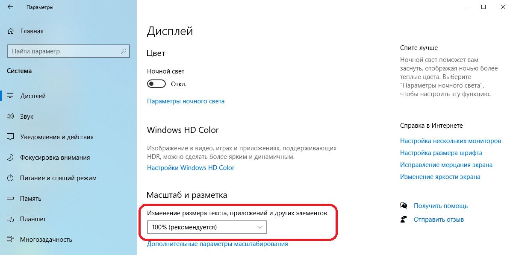
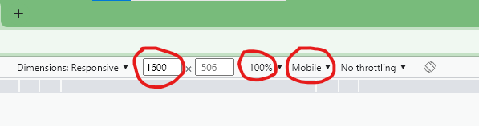
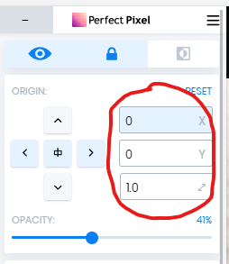

# Проверка макета с помощью расширения PerfectPixel

## Проверяем, что в ОС выставлен масштаб 100% (на многих ноутбуках 125% по умолчанию)

## Выставляем в Chrome ширину экрана 1600, масштаб 100% и тип устройства Mobile.

Тип устройства Mobile необходим потому, что в режиме Desktop полоса прокрутки справа съедает часть ширины страницы.

## В расширении PerfectPixel выставляем отступы по оси X и Y в 0 и масштаб в 1.0

